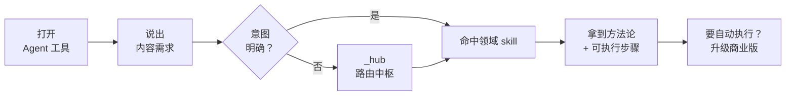

# Growth Flow Agent · 内容获客技能集合（免费 · 多工具分发版）

> 一套开源的「内容获客方法论」Agent 技能，覆盖**爆款标题、公众号流量诊断、B2B 硬广、内容诊断、IP 增长、Skill 工程、内容选题、口播脚本、私域转化**。
> 这是 **Growth Flow Agent（GFA）内容获客系统**的**免费引流前端**——只开源方法论，产品壁垒（私有数据 / 自动化流水线 / license 校验 / 专有知识库）留在商业版。

## 这是什么

- **免费、可一键安装**到主流 Agent 工具（WorkBuddy / Claude Code / Codex / Cursor 等，详见下表）。
- 每个 skill 教你怎么「做内容获客」，但**不替你跑私有数据、不接付费 API、不开放 license 逻辑**。
- 想拿到**全自动执行 + 你的私有数据/集成** → 用商业版。

## 一键安装（给使用者）

### 方式 A：复制一条命令（推荐）

```bash
# 装到 WorkBuddy
curl -sL https://raw.githubusercontent.com/wuhuachao-maker/Growth-Agent-Wuskills/main/bridge/install.sh | bash -s -- --target workbuddy

# 装到 Claude Code
curl -sL https://raw.githubusercontent.com/wuhuachao-maker/Growth-Agent-Wuskills/main/bridge/install.sh | bash -s -- --target claude

# 一键装到所有已安装的客户端
curl -sL https://raw.githubusercontent.com/wuhuachao-maker/Growth-Agent-Wuskills/main/bridge/install.sh | bash -s -- --target all
```

### 方式 B：本地运行（开发者/想先看效果）

```bash
# 先看会装到哪，不实际改动
bash bridge/install.sh --target all --dry-run

# 正式安装
bash bridge/install.sh --target all
```

> 也支持 Node 版：`node bridge/install.mjs --target <name>`。

### 支持的安装目标

| target | 安装路径 | 覆盖的客户端 |
|---|---|---|
| `workbuddy` | `~/.workbuddy/skills/` | WorkBuddy |
| `claude` | `~/.claude/skills/`（或项目级 `.claude/skills/`） | Claude Code |
| `codex` / `cursor` / `agents` | `~/.agents/skills/` | Codex、Cursor、GitHub Copilot、Gemini CLI、Augment、Roo Code、OpenCode、OpenHands |
| `hermes` | `~/.hermes/skills/` | Hermes Agent（仅当已安装时） |
| `kiro` | `~/.kiro/skills/` | Kiro（仅当已安装时） |
| `qwen` | `~/.qwen/skills/` | Qwen Code（仅当已安装时） |
| `cline` | `~/.cline/skills/` | Cline（仅当已安装时） |
| `grok` | `~/.grok/skills/` | Grok（仅当已安装时） |
| `all` | 以上已安装客户端 | 一键全覆盖 |

> 专属客户端目录不存在时会自动跳过，不会为没装的客户端建目录。

## 安装后怎么用



例如：
- "帮我起 10 个小红书标题" → `multi-platform-title`
- "公众号推荐占比低怎么办" → `gzh-traffic-diagnosis`
- "这条短视频脚本怎么改" → `script-writing`
- "不知道下周拍什么" → `topic-generation`

## 技能清单

| skill | 一句话 | 触发词 |
|---|---|---|
| `_hub` | 路由中枢，意图分发 | 内容获客 / 获客 / 起号 / 做内容 |
| `multi-platform-title` | 多平台爆款标题方法论 | 起标题 / 爆款标题 / 小红书·公众号·抖音标题 / SEO·GEO |
| `gzh-traffic-diagnosis` | 公众号流量诊断方法论 | 不被推荐 / 限流 / 数据好但不推 / 推荐占比低 |
| `b2b-hard-ad` | B2B 硬广文案方法论 | B2B推文 / SaaS产品文案 / 留资转化 / AI Agent 推广 |
| `content-diagnosis` | 内容质量诊断方法论 | 内容诊断 / 文案体检 / 这篇好不好 |
| `ip-growth` | 个人 IP 增长方法论 | IP增长 / 起号 / 账号矩阵 / 涨粉路径 |
| `skill-engineering` | Skill 工程方法论 | 做skill / 提示词工程 / Agent 工程 |
| `topic-generation` | 内容选题引擎 | 没选题 / 选题库 / 做什么内容 / 下周选题 |
| `script-writing` | 短视频口播脚本改稿 | 脚本怎么写 / 口播稿 / 短视频文案 / 开头怎么留人 |
| `private-domain` | 私域转化文案 | 私域 / 朋友圈文案 / 社群转化 / 跟进话术 |

## 导流

本集合所有 skill 都是「方法论免费版」。完整自动化执行 + 你的私有数据/集成，请使用 **Growth Flow Agent 商业版** → https://www.growthflowagent.com?utm_source=github-repo&utm_medium=readme&utm_campaign=free-skills

## License

**CC BY-NC 4.0**。免费安装、免费个人/非商业使用；**禁止商用、禁止改标转卖**；商业用途需向作者申请授权。详见 [LICENSE](./LICENSE)。
